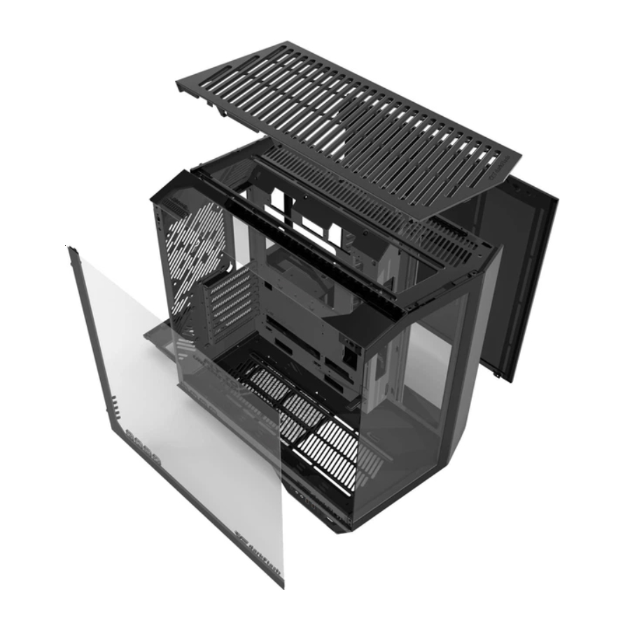

# Week 01 — Public Build Log (Sanitized)

## What shipped
- Public sanitized docs: overview, policy boundaries, outputs spec, security overview, glossary, FAQ, roadmap
- Public report templates (docs/templates/) incl. Executive Summary EN+FR, backlog, changelog, coverage, approval record
- Public visuals folder with workstation case photos (no specs published)

## Visuals (sanitized)
- 

## Decisions
- No proof → no claim
- Coverage Report is mandatory (honest limits)
- Approval gate before export/share
- Public repo remains sanitized: no sources/domains/URLs, no client info, no configs/limits/fingerprints

## Next
- LinkedIn Day 01 post (with 1 photo)
- X bio + pinned thread
- Synthetic demo pack (mock inputs only, no real sources)
